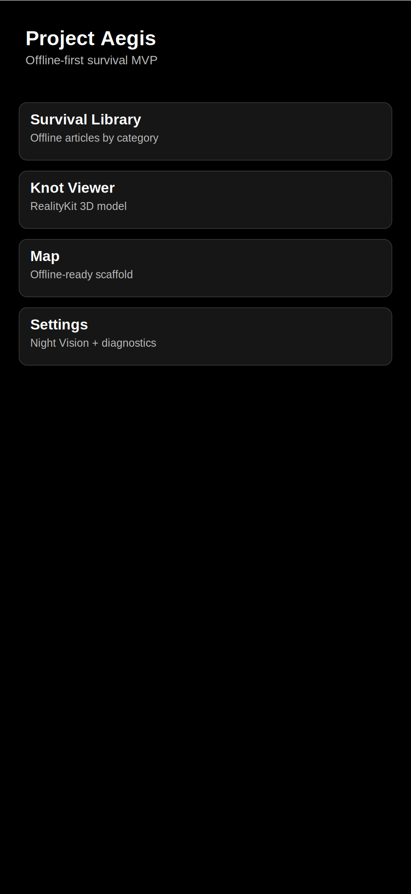
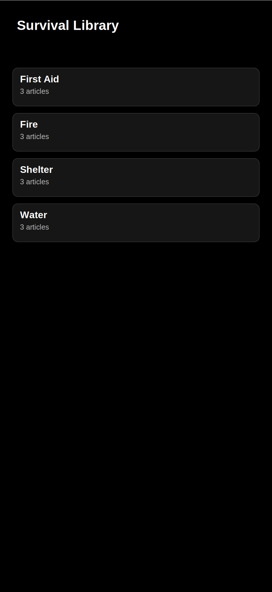
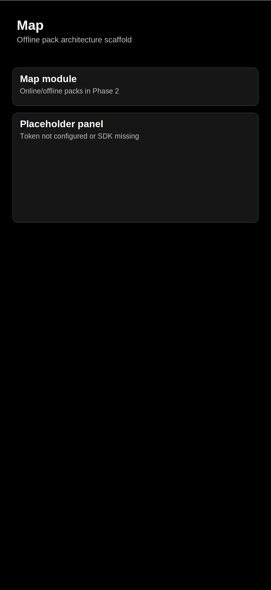
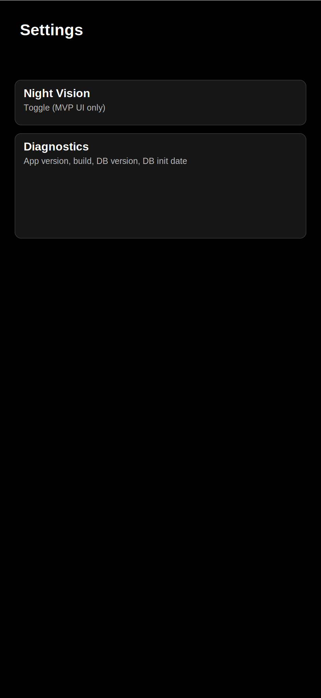
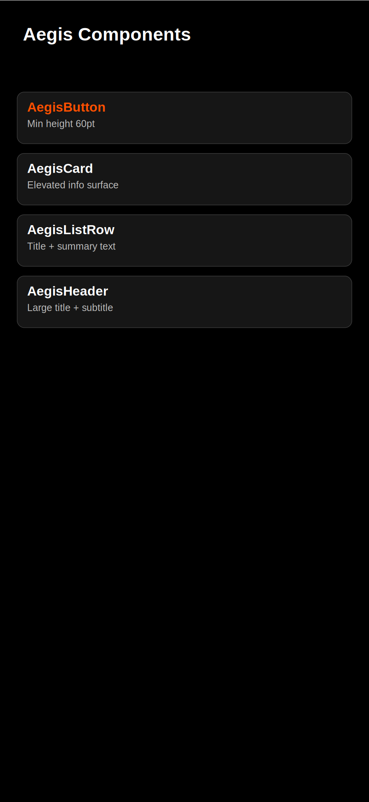

# Aegis MVP UX Element Examples

These are static visual mock examples (high-contrast True Black theme) for the MVP UI elements.

## Home

## Library Categories

## Article Detail (Step Mode)

## Map Placeholder

## Settings + Diagnostics

## Component Board

## Notes
- Accent color shown is `#FF4F00`.
- Background is true black (`#000000`) and primary text is white (`#FFFFFF`).
- Cards/buttons illustrate minimum large touch-friendly sizing intent.
